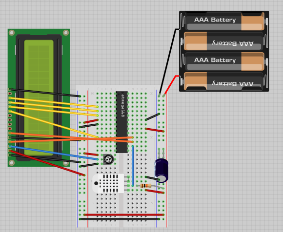

# My Arduino projects from 2013

## Humeter
Indoor temperature and humidity meter, displaying daily averages, history graph and dew point. 
Code is hardly optimized to fit in 4k and run on Atmega48.
Can be powered with 3 AA batteries (draws ~1 mA)

Required hardware: 
* DHT-11
* LCD 1602 (without backlight if you want it to run on batteries)
* Atmega48 or better configured to run on 8 MHz internal oscillator
* ~50mF 16V capacitor
* 10k resistor
* potentiometer for LCD contrast
* Arduino ISP to flash the Atmega (or another flasher)

LCD connections might be not up-to-date. Check vs code comments
